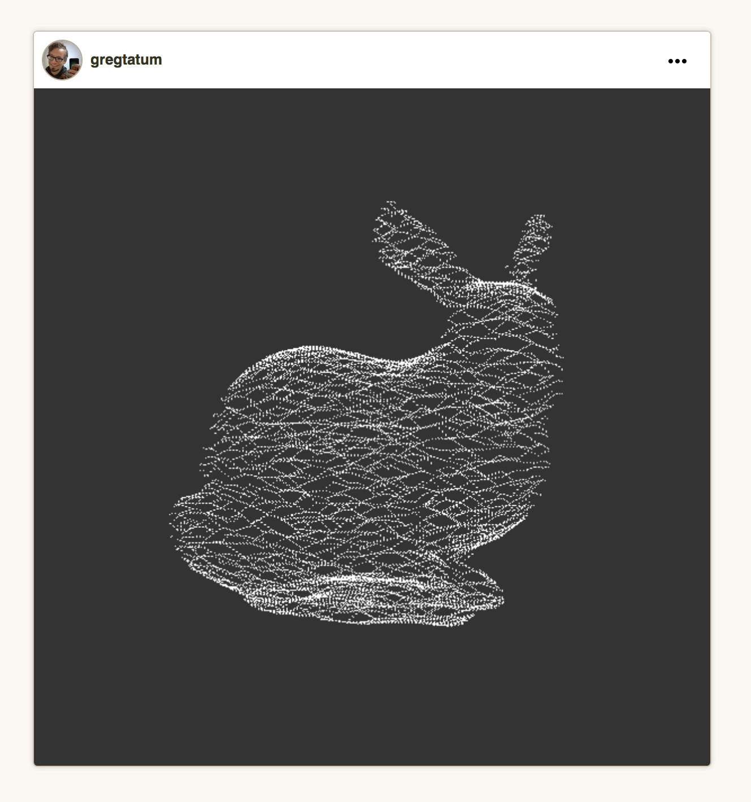
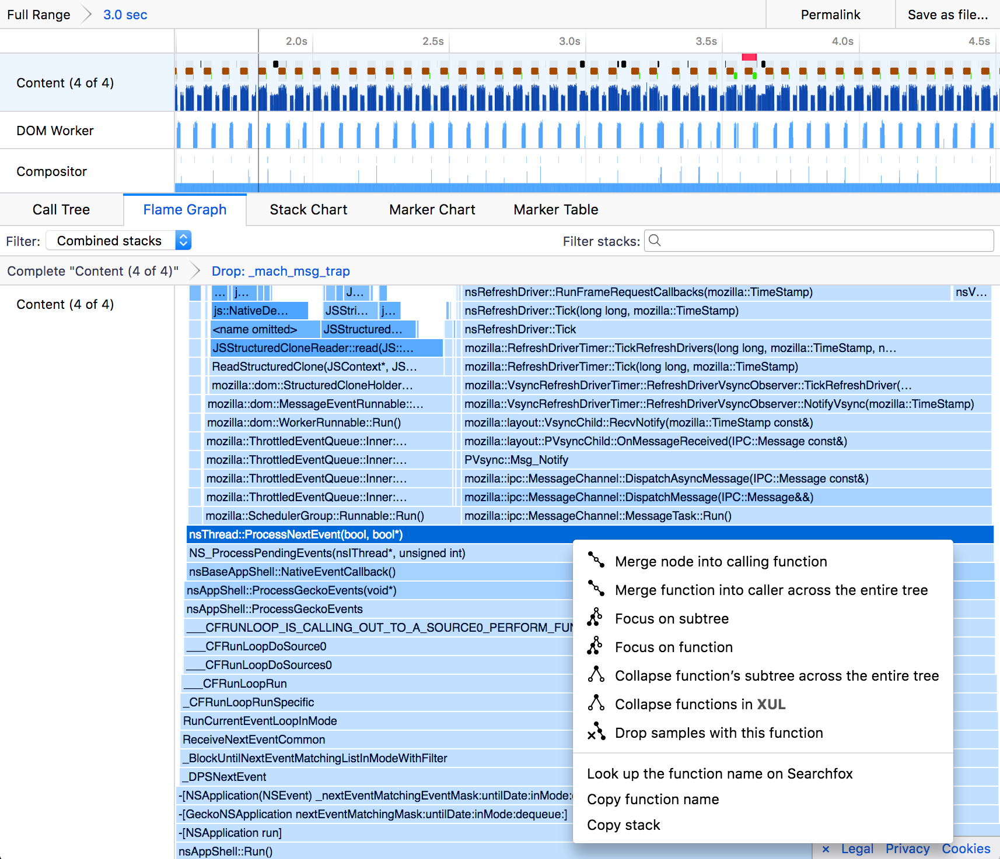
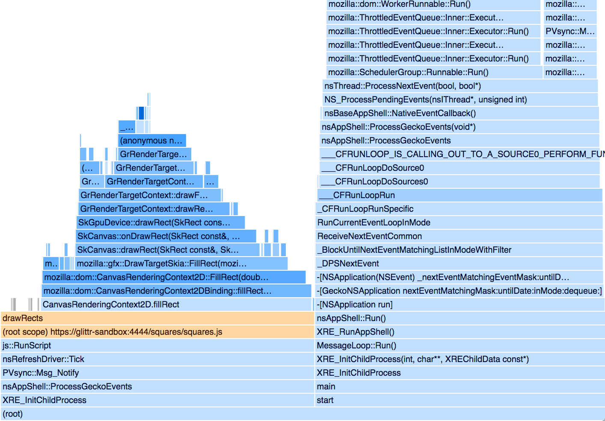
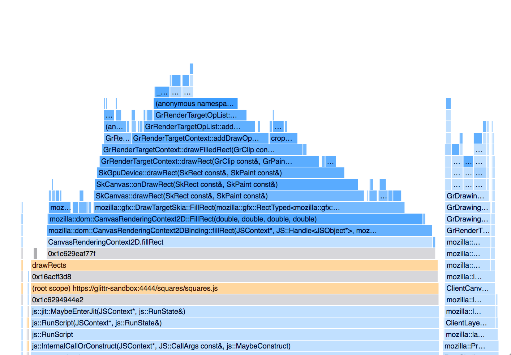

# Case Study
## 2D canvas and worker messaging

The following article is a case study in using the profiler to identify performance issues. The fixes made the code run four times faster, and changed the frame rate from from a fairly slow 15fps to a smooth 60fps. The process for this analysis follows a common pattern:

 * Profile the code
 * Identify slow areas
 * Form a hypothesis as to why it's slow
 * Act upon the hypothesis and change the code
 * Profile the code to measure the difference
 * Evaluate the effectiveness of the code change

## The project description



The project is a website that takes user's JavaScript code, and runs it to produce a visualization. The user's code only has access to the function `rect(color, x, y, width, height)`, which draws a rectangle to the screen. For the implementation, the website posts the user's code to a sandboxed iframe. The iframe has a `<canvas>` element that is rendered to via the [`CanvasRenderingContext2D`](https://developer.mozilla.org/en-US/docs/Web/API/CanvasRenderingContext2D) API. The user's code is evaluated in a WebWorker, and then the results of `rect()` are posted back to the iframe's code.

In a simplified example, the `worker.js` would run something like:

```js
// Evaluate the user's code string:
eval(`
rect('#fff', 10, 10, 3, 3);
rect('#fff', 20, 20, 3, 3);
rect('#fff', 30, 30, 3, 3);
rect('#fff', 40, 40, 3, 3);
rect('#fff', 50, 50, 3, 3);
`);

// worker.js would post something like this to the iframe:
self.postMessage({
  color: ['#fff', '#fff', '#fff', '#fff', '#fff'],
  x: [10, 20, 30, 40, 50],
  y: [10, 20, 30, 40, 50],
  w: [3, 3, 3, 3, 3],
  h: [3, 3, 3, 3, 3],
});
```

Then the iframe would draw the code using:

```js
worker.addEventListener('message', message => {
  const { data } = message;
  for (let i = 0; i < data.color.length; i++) {
    ctx.fillStyle = data.color[i];
    ctx.fillRect(data.x[i], data.y[i], data.w[i], data.h[i]);
  }
});
```

This would result in user's evaluated code drawing something to the screen, like the bunny model in the above image.

## The problem

Baseline profile: https://perfht.ml/2IxTwqi

This code ended up not scaling well for large sets of rectangles being drawn to the screen. There were lots of stutters, and a slow frame rate. The user impact for fixing this problem would be to have a smoother frame rate, plus the ability to draw many more rectangles to the screen without slowing things down. In order to validate fixes, the following steps were used to reproduce the issue.

 * Load the page with the bunny visualization.
 * Hit Ctrl Shift 1 to turn on the Gecko Profiler.
 * Wait around 5 seconds
 * Hit Ctrl Shift 2 to capture the profile.
 * Set the range to 3.0 seconds of relatively stable frames that don't have stutters or GC pauses.
 * Hide idle stacks by right clicking `__psync_cvwait` and `mach_msg_trap` in the Flame Graph, and choosing **"Drop samples with this function"**.
 * Filter the threads to:
   * The relevant content process
   * The relevant DOM Worker
   * The compositor

### Getting oriented

A nice place to start out is getting oriented with the thread stack graphs. These are in the headers and show the height of the stacks for the sample code.

Keep in mind that a higher stack doesn't mean the code took longer to execute. It only means that the stack height was taller, a rather arbitrary measure that is only useful for orienting oneself in the profile. Time is the X axis in this graph. There are gaps between the stacks. These gaps are the idle stacks that were hidden in the steps to reproduce.


The time between frames can be measured using a range selection. The brown marks represent a `RefreshDriverTick`, which shows when the browser's image on the screen was refreshed. This will be a useful metric to describe smooth animation.


The timing here is typically between 60-70ms. This is about 15 frames per second (fps), which is really too long. Visualizations should take around ~16ms per frame for the smooth 60fps visual experience.

The thread list also nicely shows the message passing between the content process' main thread and the worker thread. The content process posts a message, and then effectively waits for a response before it does anything. This is a fairly common pattern to see in multi-threaded code.

### Problems in the content process' main thread

The Flame Graph provides a nice view into a summary of where time is spent. The X axis represents the percentage of time spent with that function in that stack for all visible stacks. In a previous step the idle time was already hidden from the analysis.

The stacks are rather deep here, so a nice first step is to focus on just the subtree that is interesting. Visually, `nsThread::ProcessNextEvent` is the last function most common to the tree. Right click and focus on that subtree.



Two functions really stand out as taking a lot of time. `JSStructuredCloneReader::read` takes almost 30% of the time. It is a C++ function, and is called when the iframe receives a message from the worker. It safely reads a clone of the data, and provides it to the iframe's JavaScript code.

The bigger culprit is `drawRects`, which takes 60% of the time. This is the function that calls out the `CanvasRenderingContext2D` API to actually draw to the screen. There are two functions that are being called from drawRects. These are `set CanvasRenderingContext2D.fillStyle` and `CanvasRenderingContext2D.fillRect`.

https://perfht.ml/2Ios9PH


### Problems in the worker

Looking at the worker thread, first focus on the subtree of `(root scope) https://glittr-sandbox:4444/squares/worker.js`, as this contains the relevant code for the analysis.

https://perfht.ml/2Iu4mh4


There are two main functions that really stand out as taking up a large amount of time. The first is the `drawLineFromPoints`. This happens to be the user's code that is evaluated. Most of it we don't have control over. The `rect` function shows up, but it is a small part of the total time. `DedicatedWorkerGlobalScope.postMessage` and `JSStructuredCloneWriter::write` show up as taking most of the time. This is the part of the code where the worker is posting a message back to the iframe's JavaScript.

## Hypothesis

Based on this baseline report, the two areas that seem to be problematic are the `fillStyle` and the structured clone behavior with posting messages. Fixing these will significantly speed up the frame rate.

## Fixing `set fillStyle`

The repeated calls to `set fillStyle` are unnecessary for the bunny, as there are only 2 colors being drawn. The first is the grey background, then the second color is the white for the numerous rectangles being drawn to the screen. There is no reason to constantly re-evaluate the color. In fact, this could be a potential fix for the browser rather than this particular website.

### The code change for `set fillStyle`

The fix for this would be rather simple, of only setting the color when it's been changed.

```js
worker.addEventListener('message', message => {
  const { data } = message;
  for (let i = 0; i < data.color.length; i++) {
    const nextColor = data.color[i]
    if (prevColor !== nextColor) {
      // Only update the color if it's changed.
      ctx.fillStyle = nextColor;
      prevColor = nextColor;
    }
    ctx.fillRect(data.x[i], data.y[i], data.w[i], data.h[i]);
  }
});
```

### The resulting profile:

Strictly following the steps to reproduce from above produces the following profile:

https://perfht.ml/2IlI15x

The header shows that much less time is being spent drawing to the screen. The time before was ~65ms per frame, while now it is ~40ms. In terms of frame-rate, this is a jump from 15fps to 25fps. The change is 1.6 times faster.


The flame chart shows the summary of where time was spent. The overall length of the x axis will not change when there is less time being spent, but it can still show the magnitude of the difference. First off, on `drawRects`, there is no visible sample of `fillStyle`. This shows that the fix is working.



The flame graph can still provide the information for the magnitude of the change. The way to do this is to look at the `(root)` function on the stack. The idle stacks were dropped in the steps to reproduce, so the only remaining samples are once where (presumably) work was being done. `(root)` has a running time of 2107ms before and while it has a running time of 1613ms after. This is a difference of 1.3 times. However, the range selection is a bit fuzzy, so the FPS is probably a better indicator for this analysis, and the actual result that is visible to the end-user. It's always important to optimized for the perceived performance characteristics.

## Fixing structured cloning

The larger chunk of work, and probably harder to optimize is the [structured clone](https://developer.mozilla.org/en-US/docs/Web/API/Web_Workers_API/Structured_clone_algorithm). The definition of this algorithm is available on MDN and states:

> The structured clone algorithm is an algorithm defined by the HTML5 specification for copying complex JavaScript objects. It is used internally when transferring data to and from Workers via postMessage() or when storing objects with IndexedDB. It builds up a clone by recursing through the input object while maintaining a map of previously visited references in order to avoid infinitely traversing cycles.

This sounds like a lot of work, so is there any easier way to transfer this data and make it more dense? Right now the structure looks like this:

```js
// worker.js would post something like this to the iframe:
self.postMessage({
  color: ['#fff', '#fff', '#fff', '#fff', '#fff'],
  x: [10, 20, 30, 40, 50],
  y: [10, 20, 30, 40, 50],
  w: [3, 3, 3, 3, 3],
  h: [3, 3, 3, 3, 3],
});
```

Already the structure is optimized to not have lots of little objects, making it more GC-friendly. Perhaps it can be made more dense. The structured cloning algorithm has to take into account many of the complexities of JavaScript arrays. The entire array needs to be traversed in order to be copied, and each item needs to be considered. We know that the array at `x` only contains numbers, but the JS engine does not.

Perhaps it would be better to send over typed arrays, that better match the data that will be sent over. A typed array is probably much simpler in its internal representation for cloning.

Another thing is that duplicating the strings over and over could get expensive, and unnecessarily bloat the code. It would be better to store a table of strings, and use an array that stores indexes into that table.

## The code

This may be a little bit verbose for this analysis, so this may be useful to skim only.

The first trick is to provide a growable array, that is backed by a typed array, but allows for arbitrarily pushing on new data. This is similar to how Rust's `Vec` type works.

```js
class GrowableArray {
  constructor(dataType, capacity) {
    this.dataType = dataType;
    this.length = 0;
    this.capacity = capacity;
    this._array = new dataType(capacity);
  }

  push(number) {
    if (this.length === this.capacity) {
      this.capacity *= 2;
      const newArray = new this.dataType(this.capacity);
      for (let i = 0; i < this._array.length; i++) {
        // Copy over the values.
        newArray[i] = this._array[i];
      }
      this._array = newArray;
    }
    this._array[this.length] = number;
    this.length++;
  }

  reset() {
    this.length = 0;
  }
}
```

This is then used by:

```js
// Create a Uint16Array with an initial capacity of 512;
const array = new GrowableArray(Uint16Array, 512);
array.push(1);
array.push(3);
array.push(5);

console.log(array._array);
// > Uint16Array(16) [1, 3, 5, 0, 0, 0, 0, ... ]
console.log(array.length);
// > 3
```

Finally when posting the message, the code would send over the bare typed arrays.

```js
self.postMessage({
  stringTable,
  color: colorArray._array,
  x: xArray._array,
  y: yArray._array,
  h: hArray._array,
  w: wArray._array,
  length: colorArray.length,
})
```

This makes the code much more complex, and hard to maintain, but it could be the key to better performance. This is a common trade-off with fast code and simple code. It's important that any additional complexities are backed by an analysis that it actually affects user-perceived performance.

### The resulting structured clone profile:

Right away the visual look of the thread list is much more dense. There are many more frames being rendered to the screen.

https://perfht.ml/2Ir30DT


Zooming in now to see the timing, each frame is within the budget of 16ms per-frame. The script is now running at 60fps.

Looking at the content process now, the time is primarily being taken up in the `fillRect` call. Structured cloning doesn't really even show up. There are a few samples when filtering for it, but the time spent there is mostly negligible.



The structured cloning is also gone from the worker process. Now it is mostly the user's evaluated code, which we do not have control over.


## Conclusion

Profiling the code revealed a simple fix to setting `fillStyle`. These code changes didn't really increase complexity of the codebase but had a sizable user impact. This was a case were caching saved the cost of re-computing a value.

The structured cloning code was a more complicated problem to solve. The solution ended up increasing the complexity of the code, but is justified by the fairly dramatic end-user benefit. The solution was figured out through thinking about the algorithmic complexity of the structured cloning algorithm, and figuring out a way to fit the constraints of the project's data into a faster data structure.

In the analysis, only the functions that were taking the most time were considered for optimization. This helps to prioritize impactful work, and mitigate the dangers of introducing unneeded complexity to the codebase.

A good follow-up would be to do more analysis on a variety of different test cases to ensure that these changes didn't regress performance on a different example.

| Metric | Baseline | Fix 1 | Fix 2 | Magnitude Change |
| ----- | -------- | ------------- | ---------------------------- |
| Time per frame | ~65fps | ~40fps | ~16ms | 4x (faster) |
| Frames per second | ~15fps | ~25fps | ~60fps | 4x (faster) |
| non-idle time in `(root)` on the content process | 2107ms | 1613ms | 725ms | 2.9x (faster) |
| non-idle time in `(root)` on the worker | 666ms | 814ms | 725ms | 0.9x (slower) |
